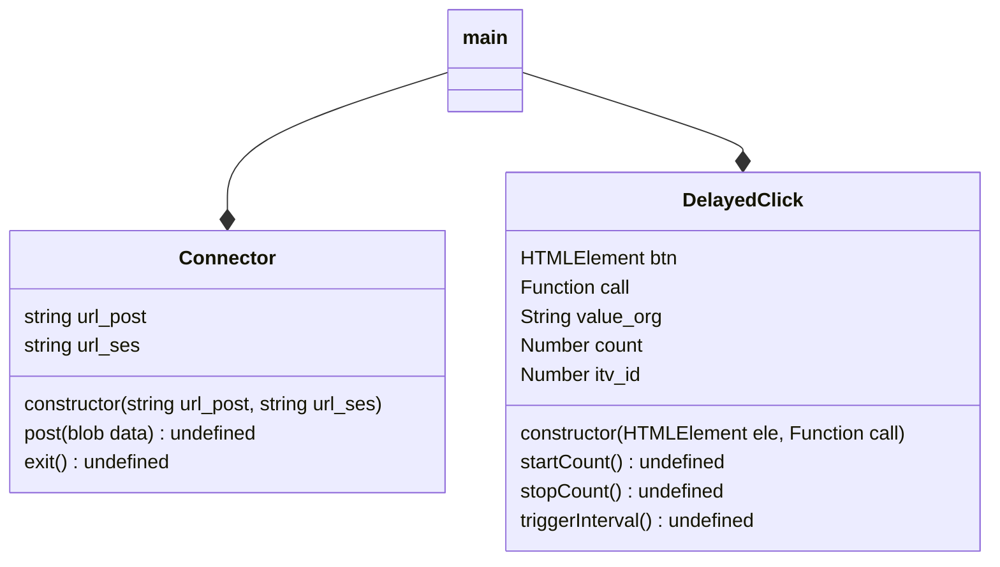
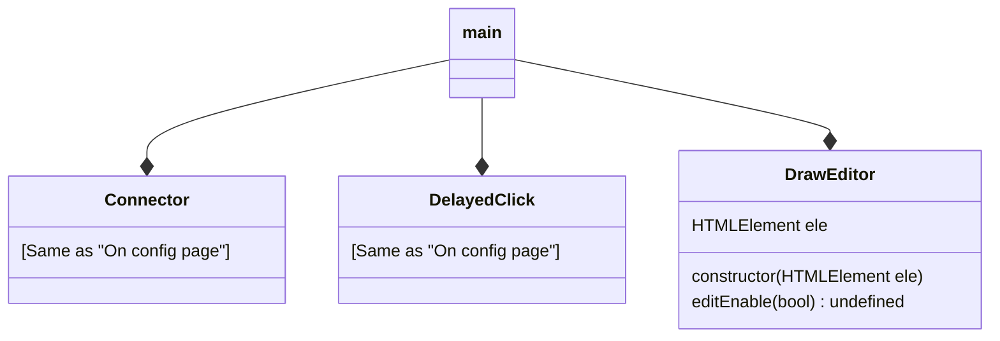

# Class

## On config page

```mermaid
classDiagram
  class main {
  }

  class Connector {
    string url_post
    string url_ses

    constructor(string url_post, string url_ses)
    post(blob data) undefined
    exit() undefined
  }

  class DelayedClick {
    HTMLElement btn
    Function call
    String value_org
    Number count
    Number itv_id

    constructor(HTMLElement ele, Function call)
    startCount() undefined
    stopCount() undefined
    triggerInterval() undefined
  }

  main --* Connector
  main --* DelayedClick
```

## On edit page

```mermaid
classDiagram
  class main {
  }

  class Connector {
    [Same as "On config page"]
  }

  class DelayedClick {
    [Same as "On config page"]
  }

  class DrawEditor {
    HTMLElement ele

    constructor(HTMLElement ele)
    editEnable(bool) undefined
  }

  main --* Connector
  main --* DelayedClick
  main --* DrawEditor
```
