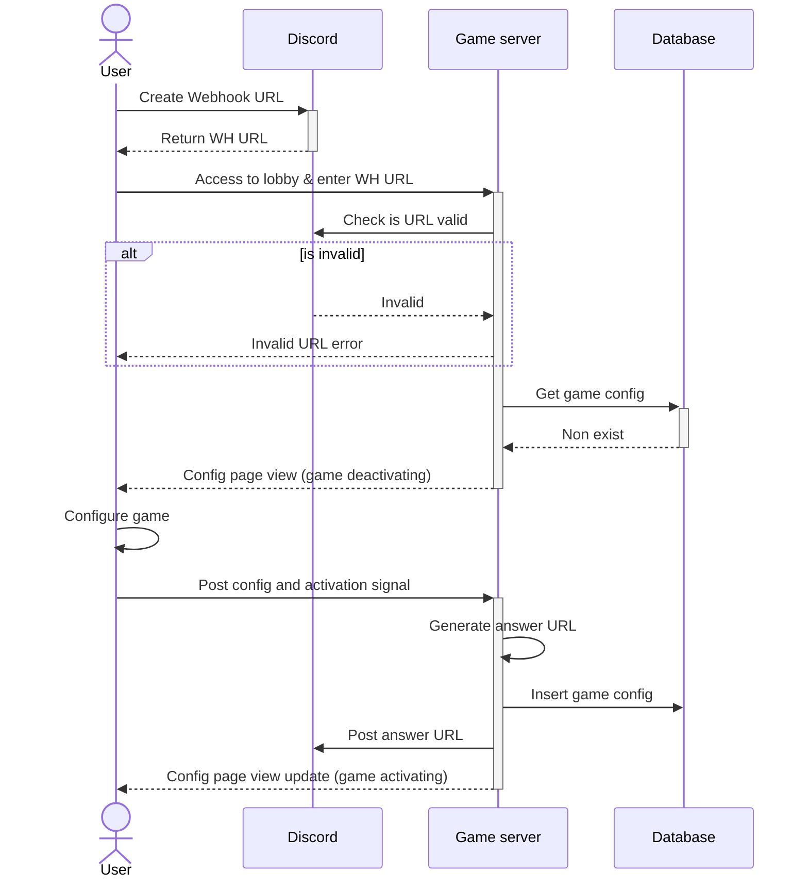
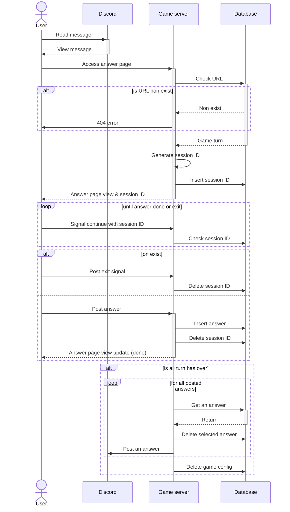
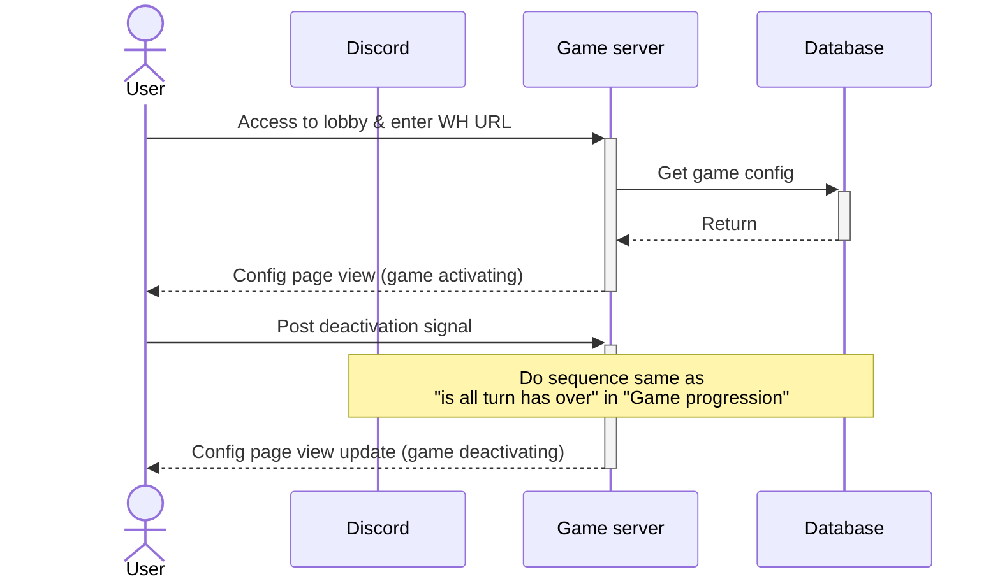

# Sequence

## Game activation

```mermaid
sequenceDiagram
  actor U as User
  participant DC as Discord
  participant G as Game server
  participant DB as Database

  U->>+DC: Create Webhook URL
  DC-->>-U: Return WH URL

  U->>+G: Access to lobby & enter WH URL
  G->>DC: Check is URL valid
  alt is invalid
    DC-->>G: Invalid
    G-->>U: Invalid URL error
  end
  G->>+DB: Get game config
  DB-->>-G: Non exist
  G-->>-U: Config page view (game deactivating)

  U->>U: Configure game
  U->>+G: Post config and activation signal
  G->>G: Generate answer URL
  G->>DB: Insert game config
  G->>DC: Post answer URL
  G-->>-U: Config page view update (game activating)
```

## Game progression

```mermaid
sequenceDiagram
  actor U as User
  participant DC as Discord
  participant G as Game server
  participant DB as Database

  U->>+DC: Read message
  DC-->>-U: View message

  U->>+G: Access answer page
  G->>+DB: Check URL
  alt is URL non exist
    DB-->>G: Non exist
    G->>U: 404 error
  end
  DB-->>-G: Game turn
  G->>G: Generate session ID
  G->>DB: Insert session ID
  G-->>-U: Answer page view & session ID

  loop until answer done or exit
    U->>G: Signal continue with session ID
    G->>DB: Check session ID
  end

  alt on exist
    U->>G: Post exit signal
    G->>DB: Delete session ID
  else
    U->>+G: Post answer
    G->>DB: Insert answer
    G->>DB: Delete session ID
    G-->>-U: Answer page view update (done)
  end

  alt is all turn has over
    loop for all posted answers
      G->>+DB: Get an answer
      DB-->>-G: Return
      G->>DB: Delete selected answer
      G->>DC: Post an answer
    end
    G->>DB: Delete game config
  end
```

## Game deactivation (Manually)

```mermaid
sequenceDiagram
  actor U as User
  participant DC as Discord
  participant G as Game server
  participant DB as Database

  U->>+G: Access to lobby & enter WH URL
  G->>+DB: Get game config
  DB-->>-G: Return
  G-->>-U: Config page view (game activating)

  U->>+G: Post deactivation signal
  Note over DC, DB: Do sequence same as <br> "is all turn has over" in "Game progression"
  G-->>-U: Config page view update (game deactivating)
```
